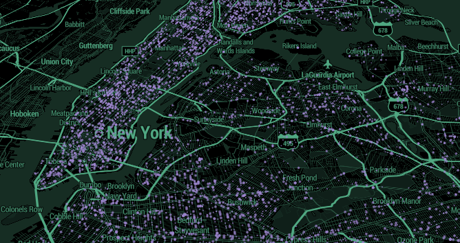

# NYC_crimes_2018
Analysis of NYPD crimes applications from fall 2016 to spring 2018.

## Motivation
This is my first learning project combining data cleaning, basic machine learning algorithms and visualistion tools together. You will not find sophisticated and complicated solutions here for now. Dataset which I bring into play could be very informative, therefore I will try to develop this project over time.

## Getting started
All noteboks form this repository are created using [kaggle](https://www.kaggle.com) kernels, so the easiest way to reproduce it would be to fork one of the following:
* [Part_I](https://www.kaggle.com/mihalw28/nyc-crimes-2018-data-cleaning-part-i)
* [Part II](https://www.kaggle.com/mihalw28/nyc-crimes-2018-random-forest-regressor-nans)
* [Part III](https://www.kaggle.com/mihalw28/fill-nans-using-regression-part-ii)
* [Part IV](https://www.kaggle.com/mihalw28/nyc-crimes-2018-visualistions)

If you are at the beginning of your data science and machine learning journey I recommend to start [here](https://www.kaggle.com/learn/overview).

## Built with

* [pandas](https://github.com/pandas-dev/pandas)
* [numpy](https://github.com/numpy/numpy)
* [scikit-learn](https://github.com/scikit-learn/scikit-learn)
* [plotly](https://plot.ly/)
* [mapbox](https://www.mapbox.com/)
* [folium](https://github.com/python-visualization/folium)
* [jupyter](https://jupyter.org/)
* and others

## Credits
* [Hands-On ML](https://github.com/ageron/handson-ml)
* Many credits due to kaggle kernels' model are placed within jupyter notebooks.

## License
This project is licensed under the MIT License - see the [LICENSE.md](https://github.com/mihalw28/NYC_crimes_2018/blob/master/LICENSE) file for details.

MIT © [mihalw28](https://twitter.com/mihalw28)
